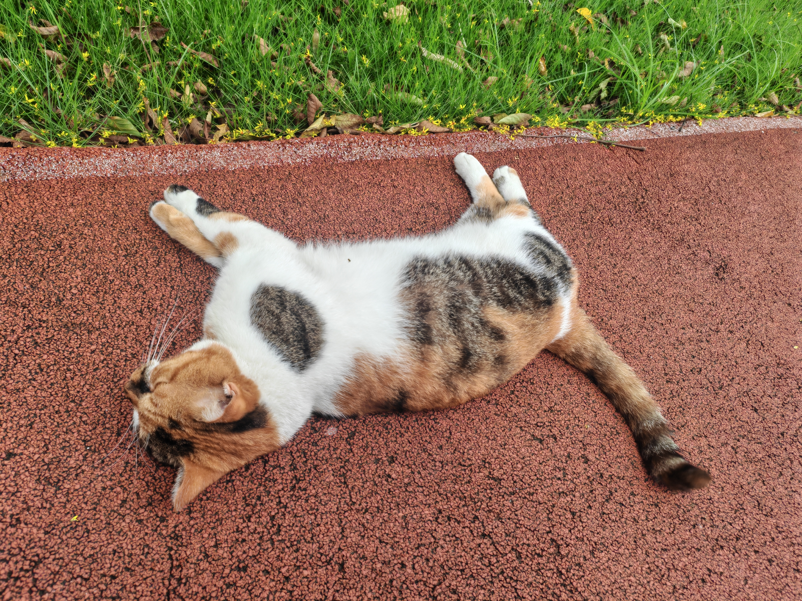
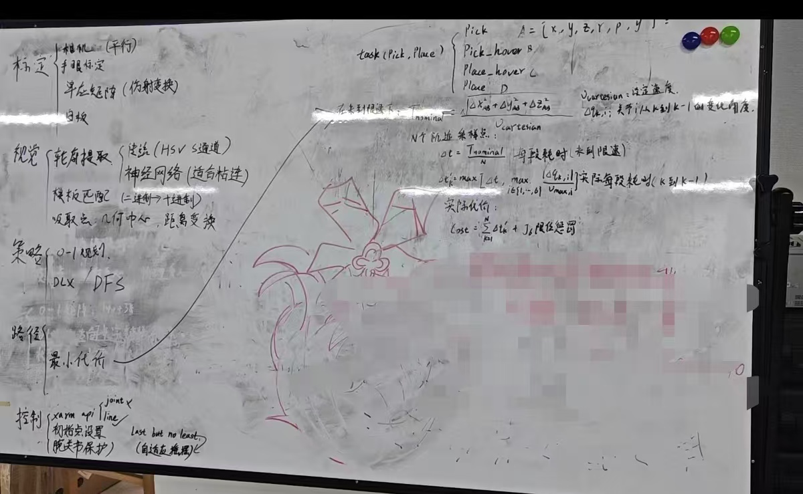

# 上师大弈方队



## 项目简介

一个 **ROS 1 (Noetic)** catkin 工作区，驱动一台 **xArm6** 机械臂完成一个精确覆盖装箱任务：
用 **RealSense** 相机识别背光板上的彩色多联骨牌（"俄罗斯方块"），再用**真空吸盘**把它们
抓取并放入固定的 **14×10** 网格，目标是放进尽可能多的方块。

物理叠放关系（务必记清）：**白板（14×10 放置网格，带 140 个 2~3mm 凸起）叠在发光板
（背光板，抓取/散料源区）上面**。标定里 `board_frame` 的 z=0 平面在**发光板**上，白板
表面/凸起在 board 系 z 为正。详见 [标定指南](calibrate.md)。

活跃开发都在 [src/lucky](../src/lucky)；`src/` 下其余（`xarm_ros`、`realsense-ros`、`vision_opencv`、
`easy_handeye`）是引入的第三方依赖，当作已安装的包对待。

## 硬件与环境

| 项 | 说明 |
|---|---|
| 机械臂 | UFACTORY xArm6（末端真空吸盘，数字 IO 控制电磁阀，CO0 / `io_num=1`）|
| 相机 | Intel RealSense D415（eye-on-hand，装在末端）|
| 工作区 | 背光板（抓取源区）+ 叠在其上的 14×10 白板（放置网格）|
| 系统 | Ubuntu 20.04 / ROS Noetic / CUDA 11.8 + cuDNN 8（容器内，见 [Dockerfile](../docker/Dockerfile)）|

物料清单见 [checklist.md](../checklist.md)。

## 快速开始

### 1. 准备环境（Docker）

- **Linux**：用本仓库的 [docker-compose.yml](../docker/docker-compose.yml) 构建环境镜像：
  ```bash
  cd docker
  docker-compose up -d --build
  ```
- **Windows / WSL2（不推荐）**：见 [docker_setup.md](docker_setup.md)（导入 `.tar` 镜像 + devcontainer）
  与 [wsl_usb.md](wsl_usb.md)（用 usbipd-win 挂载 USB，网络设 **nat** 不要 mirror）。
- 第三方源码包 `xarm_ros` / `realsense-ros` / `easy_handeye` / `vision_opencv` 已被
  [.gitignore](../.gitignore) 排除，**必须存在于挂载进来的 `src/` 里**（镜像不含它们）。
```bash
cd catkin_ws/src
git clone -b ros1-legacy https://github.com/realsenseai/realsense-ros.git 
git clone https://github.com/xArm-Developer/xarm_ros.git
git clone https://github.com/IFL-CAMP/easy_handeye.git
git clone -b noetic https://github.com/ros-perception/vision_opencv.git
```

### 2. 下载 DexiNed 边缘检测模型

生产默认视觉节点是 DexiNed（`vision_processor_node_dexined`），需要 ONNX 模型：

- 下载：<https://huggingface.co/opencv/edge_detection_dexined>
- 放到：[src/lucky/module/dexined.onnx](../src/lucky/module/dexined.onnx)
- 节点参数 `dexined_model_path` 默认是容器内绝对路径 `/root/catkin_ws/src/lucky/module/dexined.onnx`；
  工作区不在 `/root/catkin_ws` 时需在 launch 里覆盖该参数。

### 3. 编译

```bash
source /opt/ros/noetic/setup.bash
catkin_make            # 在 /root/catkin_ws 下执行 —— 唯一在用的构建流程
source devel/setup.bash
```

> [CMakeLists.txt](../src/lucky/CMakeLists.txt) 强制 `-std=c++14` 和 `-O3`（`-O3` 是为 `strategy_node`
> 的 DLX 搜索加的，别去掉）。编译出 5 个节点：`vision_processor_node_dexined`、
> `vision_processor_node_cpp`、`strategy_node`、`path_planner_node`、`xarm_controller_node`。

### 4. 允许容器访问 X11（在宿主机终端）

```bash
xhost +local:docker
```

### 5. 标定

**首次上真机前必须标定**（手眼 + 白板 + 抓取单应性）。整套流程见
[标定指南](calibrate.md)。标定结果写入 [tetris_config.yaml](../src/lucky/config/tetris_config.yaml)（当作数据，别手改）。

### 6. 运行完整流水线

```bash
roslaunch lucky lucky.launch robot_ip:=<机械臂IP>     # 默认 192.168.1.216
# 控制节点默认 require_ready=true：规划好后等 /ready 放行才开始执行
rostopic pub -1 /ready std_msgs/Bool "{data: true}"
```

切换经典视觉实现（非神经网络边缘检测，无需 onnx 模型）：

```bash
roslaunch lucky lucky.launch robot_ip:=<机械臂IP> vision_node:=vision_processor_node_cpp
```

> 两个视觉节点各配一套 RealSense 曝光/色彩档（`dynparam` 灌进 `/camera/rgb_camera`）：
> DexiNed 用 [camera_config.yaml](../src/lucky/config/camera_config.yaml)（launch 默认加载），经典 `_cpp` 用
> [camera_config_1.yaml](../src/lucky/config/camera_config_1.yaml)（高对比、去饱和）。切到 `_cpp` 时需把
> [lucky.launch](../src/lucky/launch/lucky.launch) 里 `load_rgb_cfg` 加载的相机档一并换成后者，详见
> [vision.md §9](vision.md#9-运行与调参)。

## 节点流水线

四个自定义节点通过固定的话题契约串联：

| 顺序 | 节点 | 职责 | 文档 |
|---|---|---|---|
| 1 | `vision_processor_node_dexined` / `_cpp` | 分割/分类背光板上的方块，发布库存 + 占用栅格 + 逐块像素 | [vision.md](vision.md) |
| 2 | `strategy_node` | 把 14×10 放置当精确覆盖问题，用 DLX 搜最高分覆盖，发候选布局 | [strategy.md](strategy.md) |
| 3 | `path_planner_node` | 像素→base 抓取、格子→base 放置、腕部翻转择优、关节时间代价优化 | [path_plan.md](path_plan.md) |
| 4 | `xarm_controller_node` | 纯执行器：用 xArm **原生服务**（非 MoveIt）逐任务执行抓—搬—放 | [control.md](control.md) |

`/vision/board_state` → `/tetris_plan(_candidates)` → `/motion_cmds` → 真机。

## 分节点测试 launch

只起某个节点需要的东西，省得跑整条 [lucky.launch](../src/lucky/launch/lucky.launch)：

| launch | 作用 | 是否驱动真机 |
|---|---|---|
| [test_vision.launch](../src/lucky/launch/test_vision.launch) | 仅视觉（相机 + 视觉节点）| 否 |
| [test_strategy.launch](../src/lucky/launch/test_strategy.launch) | 仅策略（喂假 `board_state`，看 `/tetris_plan`）| 否 |
| [test_path.launch](../src/lucky/launch/test_path.launch) | 感知→策略→路径链路（需臂提供 TF/joint_states，不起控制节点）| 否 |
| [test_controller.launch](../src/lucky/launch/test_controller.launch) | path_planner + 控制器 + 臂 + 相机（手动喂 `/tetris_plan`，还需发 `/ready`）| **是（限 1 任务）** |
| [test_pick.launch](../src/lucky/launch/test_pick.launch) | 旧 MoveIt 单块集成测试；**已与现架构脱节、不可用**（不起 path_planner，控制节点收不到 `/motion_cmds`）| — |

## 常用命令

```bash
# 相机内参：输出里的 K 矩阵 = [fx, 0, cx, 0, fy, cy, 0, 0, 1]
rostopic echo /camera/color/camera_info

# 末端真实位姿（base ← eef）
rosrun tf tf_echo link_base link_eef

# 手眼 TF 广播（eye-on-hand）
roslaunch easy_handeye publish.launch eye_on_hand:=true namespace_prefix:=xarm6_realsense_calibration

# 单独起各组件（调试用）
roslaunch xarm_bringup xarm6_server.launch robot_ip:=192.168.1.216
roslaunch realsense2_camera rs_camera.launch align_depth:=true
rosrun lucky vision_processor_node_dexined
rosrun lucky strategy_node
rosrun lucky path_planner_node
rosrun lucky xarm_controller_node
```

## 文档索引

| 文档 | 内容 |
|---|---|
| [calibrate.md](calibrate.md) | 末端 TCP + 手眼 + 白板 + 抓取单应性标定全流程 |
| [vision.md](vision.md) | 视觉感知子系统（分割、分类、抓取点）|
| [strategy.md](strategy.md) | 策略节点（精确覆盖 / DLX 求解）|
| [path_plan.md](path_plan.md) | 路径规划节点（坐标解算、腕部翻转、路程优化）|
| [control.md](control.md) | 控制节点（纯执行器，xArm 原生服务）|
| [docker_setup.md](docker_setup.md) | Windows/WSL2 下导入镜像与 devcontainer |
| [wsl_usb.md](wsl_usb.md) | WSL2 用 usbipd-win 挂载 USB 设备 |
| [precautions.md](precautions.md) | **注意事项与踩坑汇总**（安全、关节/运动学、标定、坐标系、代码结构）|

## 可选：CUDA 加速的 OpenCV（进阶）

默认镜像用 apt 版 OpenCV 4.2（**无 CUDA**）。DexiNed 节点在 C++ 里用 `cv::dnn` 并强制设
CUDA 后端；OpenCV 未带 CUDA 时推理会退回 CPU，可用但较慢。若要用 GPU 加速 DexiNed，需从源码
编译带 CUDA/cuDNN 的 OpenCV（+ contrib）：

- 源码：<https://github.com/opencv/opencv/releases> 与
  <https://github.com/opencv/opencv_contrib/tags>
- 解压后编译（`CUDA_ARCH_BIN` 按你的 GPU 计算能力调整）：

```bash
cmake -D CMAKE_BUILD_TYPE=RELEASE \
      -D CMAKE_INSTALL_PREFIX=/usr/local \
      -D WITH_CUDA=ON \
      -D WITH_CUDNN=ON \
      -D WITH_CUBLAS=ON \
      -D OPENCV_DNN_CUDA=ON \
      -D ENABLE_FAST_MATH=1 \
      -D CUDA_FAST_MATH=1 \
      -D OPENCV_EXTRA_MODULES_PATH=../opencv_contrib/modules \
      -D BUILD_opencv_world=ON \
      -D CUDA_ARCH_BIN=8.6,8.9 \
      ../opencv
```

## 安全注意事项

- **示教器急停常备**：任何真机运行时，控制器（示教器）必须在手边，随时能按急停（见 [precautions.md](precautions.md)）。
- 相机数据线务必设**最大速度/加速度上限**，防止折断（见 [precautions.md](precautions.md)）。
- 执行前确认空气压缩机已开启。
- 上真机前确认已完成标定，且 J1/J4/J6 未绕在 ±360° 边界附近（详见 [CLAUDE.md](../CLAUDE.md) 与
  [precautions.md §2.1](precautions.md#21-启动-moveit--realmove_exec-前j1j4j6-必须远离-360-边界)）。


> 尽人事，听天命。最后，非常感谢老师以及往届学长学姐的帮助与支持。

## 附：团队设计草图

<details>
<summary>最初在白板上讨论的系统框架（标定 / 视觉 / 策略 / 路径 / 控制）</summary>



</details>
